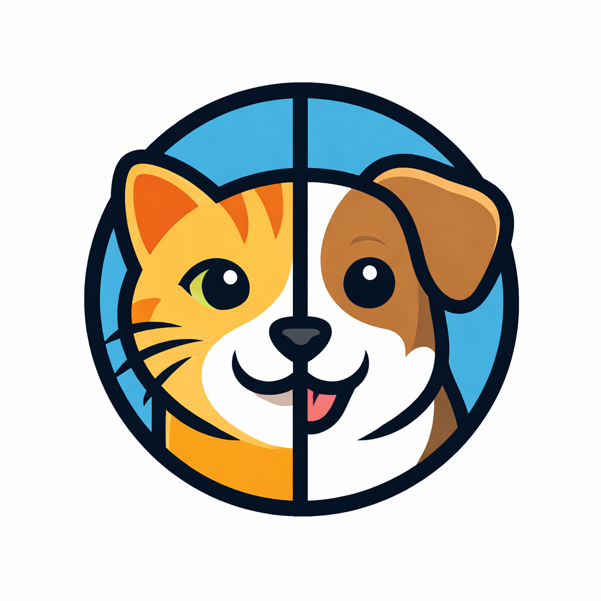
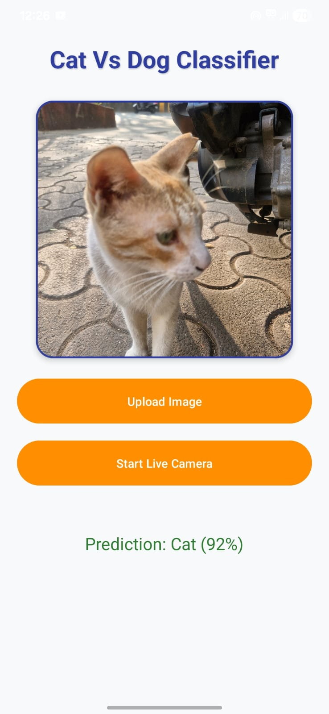

  

<h1 align="center">PawVision</h1>

Real-time cat vs dog detection on Android, running fully on-device.

## Story

I built this right after finishing Andrew Ng's **Machine Learning Specialization**. I wanted to see a model go beyond a notebook, so I trained a classifier on the classic Kaggle Dogs vs Cats dataset and turned it into a real Android app.

- **v1** — a `MobileNetV3Large` transfer-learning classifier (Keras), converted to an int8 TFLite model. Single-shot classification on a gallery image.
- **v2 (current)** — retrained as a **YOLO11** detector so the app can draw a live bounding box and run continuously off the camera feed, not just on uploaded photos.

Training notebook (Kaggle, free to fork and re-run yourself): **[Dog vs Cat Detection](https://www.kaggle.com/code/abhijitdalal26/dog-vs-cat-detection/)**

## Demo

Detected a real stray cat outside, live, at 92% confidence:

  

## How it works

- **CameraX** streams frames from the live camera preview (and handles gallery image picking).
- Each frame is resized to 640×640, normalized, and run through a `float16` YOLO11 model on-device via **TensorFlow Lite**.
- The raw output is decoded into bounding boxes + Cat/Dog confidence and drawn on a `Canvas` overlay.
- Live inference is throttled to ~300ms per frame so it doesn't peg the CPU.

## Tech stack

**App:** Kotlin, CameraX, TensorFlow Lite (YOLO11, float16), Android Views + Canvas overlay
**Model training:** Python, TensorFlow/Keras, MobileNetV3Large transfer learning, Kaggle

## Try it

- **APK** — zipped in this repo as [`PawVision.zip`](PawVision.zip). Download, unzip, install (you'll need to allow "install unknown apps").
- **Build it yourself** — clone the repo and open in Android Studio (`minSdk 26`, `compileSdk 35`).

## License

MIT - see [LICENSE](LICENSE).
